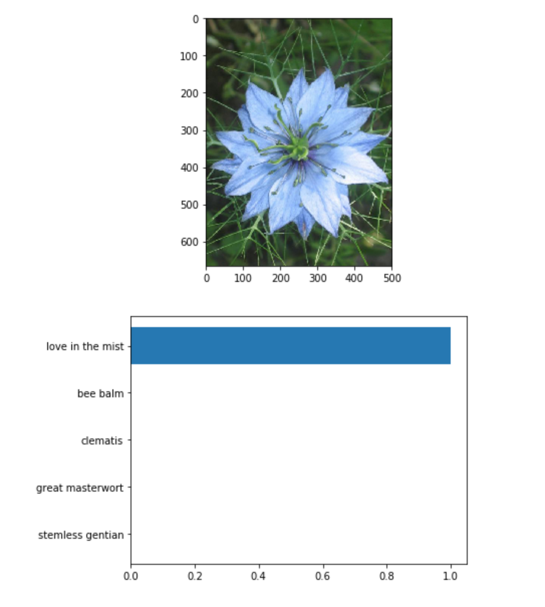

<h1><strong>PyTorch Scholarship Facebook Challenge Final Project</strong></h1>

The final project consist a deep learning convolutional network model to measure accuracy on classifying flower species.

The <a href="http://www.robots.ox.ac.uk/~vgg/data/flowers/102/index.html">data set</a> contains images of flowers from 102 different species

